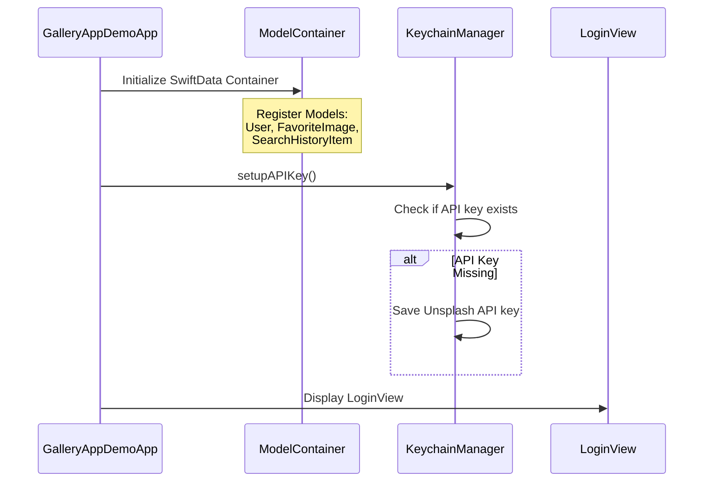

# Gallery App - Complete Workflow Documentation

## 📱 Application Overview

A SwiftUI-based iOS image gallery app that integrates with the Unsplash API, featuring user authentication, image search, favorites management, and persistent storage.

---

## 🏗️ Architecture Overview


---

## 🔄 Complete Application Flow

### 1. App Initialization Flow



**Code Location:** [`GalleryAppDemoApp.swift`](GalleryAppUpdated/GalleryAppDemoApp.swift:10-24)

**Key Functions:**
- `init()` - Initializes ModelContainer and sets up API key
- `setupAPIKey()` - Stores Unsplash API key in Keychain

---

### 2. Authentication Flow


**Code Locations:**
- Login: [`LoginView.swift`](GalleryAppUpdated/Views/LoginView.swift:137-155)
- Create Account: [`CreateAccountView.swift`](GalleryAppUpdated/Views/CreateAccountView.swift:96-125)
- Biometric Auth: [`LoginView.swift`](GalleryAppUpdated/Views/LoginView.swift:170-191)

**Key Functions:**
- `handleLogin()` - Validates credentials and logs in user
- `createAccount()` - Creates new user account
- `authenticateWithBiometrics()` - Handles Face ID/Touch ID authentication

---

### 3. Main Tab Navigation Flow


**Code Location:** [`MainTabView.swift`](GalleryAppUpdated/Views/MainTabView.swift:8-59)

**Key Components:**
- Custom floating tab bar with 3 tabs
- State management with `@State private var selectedTab`
- Passes `user` object to all child views

---

### 4. Image Search Workflow


**Code Locations:**
- Search UI: [`SearchView.swift`](GalleryAppUpdated/Views/SearchView.swift:166-183)
- ViewModel: [`ImageSearchViewModel.swift`](GalleryAppUpdated/ViewModels/ImageSearchViewModel.swift:75-96)
- API Call: [`ImageSearchViewModel.swift`](GalleryAppUpdated/ViewModels/ImageSearchViewModel.swift:100-151)

**Key Functions:**
- `performSearch(text)` - Initiates search from UI
- `searchImages(query, username)` - Manages search logic and caching
- `loadMoreImages()` - Implements infinite scroll pagination
- `addToSearchHistory(query)` - Saves search to SwiftData

---

### 5. Favorites Management Workflow


**Code Locations:**
- Toggle Logic: [`SearchView.swift`](GalleryAppUpdated/Views/SearchView.swift:252-290)
- Image Download: [`SearchView.swift`](GalleryAppUpdated/Views/SearchView.swift:292-311)
- Storage: [`ImageCacheManager.swift`](GalleryAppUpdated/Storage/ImageCacheManager.swift:130-148)

**Key Functions:**
- `toggleFavorite()` - Main favorite toggle logic
- `downloadImage(from:)` - Downloads full-resolution image
- `saveFavoriteImage(_:for:)` - Saves image to permanent storage
- `deleteFavoriteImage(for:)` - Removes image from storage

---

### 6. Image Caching System


**Code Location:** [`ImageCacheManager.swift`](GalleryAppUpdated/Storage/ImageCacheManager.swift:1-213)

**Key Components:**

#### Temporary Cache (Search Results)
- **Location:** `Caches/ImageCache/`
- **Naming:** SHA256 hash of URL
- **Limit:** 20 images (LRU eviction)
- **Format:** PNG

#### Permanent Storage (Favorites)
- **Location:** `Documents/FavoritesCache/`
- **Naming:** `{imageId}.jpg`
- **Limit:** None
- **Format:** JPEG (85% quality)

**Key Functions:**
- `saveImage(_:for:)` - Save to temporary cache
- `loadImage(from:)` - Load from temporary cache
- `saveFavoriteImage(_:for:)` - Save to permanent storage
- `loadFavoriteImage(for:)` - Load from permanent storage
- `enforceLimit()` - LRU cache eviction

---

### 7. Data Models & Relationships


**Code Locations:**
- User Model: [`UserModel.swift`](GalleryAppUpdated/Models/UserModel.swift:4-20)
- Favorite Model: [`FavoriteModel.swift`](GalleryAppUpdated/Models/FavoriteModel.swift)
- Search History: [`SearchHistoryItemModel.swift`](GalleryAppUpdated/Models/SearchHistoryItemModel.swift)
- Unsplash Models: [`UnsplashModels.swift`](GalleryAppUpdated/Models/UnsplashModels.swift:1-42)

**Relationships:**
- `@Relationship(deleteRule: .cascade)` - Deleting user deletes all favorites and history
- SwiftData automatically manages relationships

---

### 8. Security & Storage Architecture


**Code Locations:**
- Keychain: [`KeychainManager.swift`](GalleryAppUpdated/ViewModels/KeychainManager.swift:1-88)
- SwiftData: [`GalleryAppDemoApp.swift`](GalleryAppUpdated/GalleryAppDemoApp.swift:13-20)
- File System: [`ImageCacheManager.swift`](GalleryAppUpdated/Storage/ImageCacheManager.swift:16-53)

**Security Features:**
- Passwords encrypted in Keychain
- API key stored securely
- Face ID/Touch ID authentication
- Biometric data never stored (handled by iOS)

---

## 📊 Function Call Hierarchy

### App Launch Sequence

```
1. GalleryAppDemoApp.init()
   ├── ModelContainer.init(for: User, FavoriteImage, SearchHistoryItem)
   └── setupAPIKey()
       └── KeychainManager.shared.savePassword("API_KEY", for: "unsplash_api_key")

2. LoginView appears
   └── onAppear: checkBiometrics()
       └── LAContext.canEvaluatePolicy()
```

### Login Flow

```
LoginView.handleLogin()
├── Query SwiftData for user
├── KeychainManager.shared.getPassword(for: username)
├── Validate password match
├── UserDefaults.set(username, forKey: "biometric_enabled_username")
└── Navigate to MainTabView(user: user)
```

### Search Flow

```
SearchView.performSearch(query)
└── ImageSearchViewModel.shared.searchImages(query, username)
    ├── addToHistory(query, username)
    ├── Check cachedResults[query]
    └── loadMoreImages()
        ├── KeychainManager.shared.getPassword(for: "unsplash_api_key")
        ├── URLSession.shared.data(from: unsplashURL)
        ├── JSONDecoder().decode(UnsplashSearchResponse.self)
        └── Update @Published images array
```

### Favorite Toggle Flow

```
ImageCard.toggleFavorite()
├── Check if already favorite
├── If removing:
│   ├── user.favorites.removeAll { $0.id == favorite.id }
│   ├── modelContext.delete(favorite)
│   ├── ImageCacheManager.shared.deleteFavoriteImage(for: imageId)
│   └── modelContext.save()
└── If adding:
    ├── downloadImage(from: imageURL)
    ├── ImageCacheManager.shared.saveFavoriteImage(image, for: imageId)
    │   └── image.jpegData(compressionQuality: 0.85).write(to: fileURL)
    ├── Create FavoriteImage object
    ├── modelContext.insert(favorite)
    ├── user.favorites.append(favorite)
    └── modelContext.save()
```

### Image Caching Flow

```
CachedAsyncImage(urlString)
├── Check ImageCacheManager.shared.loadImage(from: urlString)
├── If cached: Display immediately
└── If not cached:
    ├── URLSession.shared.data(from: URL)
    ├── Create UIImage from data
    ├── ImageCacheManager.shared.saveImage(image, for: urlString)
    │   ├── enforceLimit() - Check if cache full
    │   │   └── Delete oldest file if count >= 20
    │   └── image.pngData().write(to: fileURL)
    └── Display image
```

---

## 🔑 Key Components Summary

### 1. **GalleryAppDemoApp** (Entry Point)
- Initializes SwiftData ModelContainer
- Sets up Unsplash API key in Keychain
- Displays LoginView as root

### 2. **LoginView** (Authentication)
- Validates user credentials
- Supports Face ID/Touch ID
- Navigates to MainTabView on success

### 3. **MainTabView** (Navigation Hub)
- Custom floating tab bar
- Manages 3 tabs: Search, Favorites, Profile
- Passes user object to all views

### 4. **SearchView** (Image Search)
- Search bar with history dropdown
- Infinite scroll grid of images
- Integrates with ImageSearchViewModel

### 5. **ImageSearchViewModel** (Business Logic)
- Manages API calls to Unsplash
- Implements pagination
- Caches search results
- Tracks per-user search history

### 6. **FavoritesView** (Saved Images)
- Displays user's favorite images
- Loads from permanent storage
- Shows count of favorites

### 7. **ImageDetailView** (Full Image View)
- Full-screen image display
- Share functionality
- Add/remove favorites
- View on Unsplash

### 8. **ImageCacheManager** (Storage)
- Two-tier caching system
- LRU eviction for temporary cache
- Permanent storage for favorites

### 9. **KeychainManager** (Security)
- Secure password storage
- API key management
- CRUD operations on Keychain

### 10. **SwiftData Models** (Data Layer)
- User, FavoriteImage, SearchHistoryItem
- Automatic relationship management
- Cascade delete rules

---

## 🎯 Data Flow Summary

### User Authentication
```
User Input → LoginView → SwiftData Query → Keychain Verification → MainTabView
```

### Image Search
```
Search Query → ImageSearchViewModel → Unsplash API → JSON Decode → UI Update
```

### Favorites Management
```
Heart Tap → Download Image → Save to Disk → Create SwiftData Record → UI Update
```

### Image Display
```
URL Request → Check Cache → Load/Download → Display → Save to Cache
```

---

## 📱 UI Component Hierarchy

```
GalleryAppDemoApp
└── LoginView
    ├── CreateAccountView
    └── MainTabView
        ├── SearchView
        │   ├── Search Bar
        │   ├── History Dropdown
        │   ├── LazyVGrid
        │   │   └── ImageCard
        │   │       └── NavigationLink → ImageDetailView
        │   └── Infinite Scroll Trigger
        │
        ├── FavoritesView
        │   ├── Title with Count
        │   ├── LazyVGrid
        │   │   └── FavoriteImageCard
        │   │       └── NavigationLink → ImageDetailView
        │   └── Empty State
        │
        └── ProfileView
            ├── User Info Card
            ├── Settings Rows
            └── Logout Button
```

---

## 🔄 State Management

### @Published Properties (Observable)
- `ImageSearchViewModel.images` - Search results
- `ImageSearchViewModel.isLoadingMore` - Loading state
- `ImageSearchViewModel.histories` - Search history per user

### @State Properties (View-local)
- `LoginView.username`, `password` - Form inputs
- `SearchView.query` - Search input
- `MainTabView.selectedTab` - Active tab index

### @Environment Properties (Injected)
- `modelContext` - SwiftData context
- `dismiss` - Navigation dismissal

### @Query Properties (SwiftData)
- `users: [User]` - All users from database

---

## 🎨 Presentation Tips

### For PPT/Slides:

1. **Slide 1: Architecture Overview**
   - Use the first Mermaid diagram
   - Highlight 3 layers: Data, Views, ViewModels

2. **Slide 2: User Journey**
   - Show authentication flow diagram
   - Emphasize security (Keychain, Biometrics)

3. **Slide 3: Core Features**
   - Image search with infinite scroll
   - Favorites with offline access
   - Smart caching system

4. **Slide 4: Technical Highlights**
   - SwiftUI + SwiftData
   - Two-tier caching
   - Unsplash API integration
   - Secure storage

5. **Slide 5: Data Flow**
   - Show search workflow sequence diagram
   - Highlight API → Cache → UI flow

6. **Slide 6: Storage Architecture**
   - Security & Storage diagram
   - Explain Keychain vs SwiftData vs File System

### Key Talking Points:

✅ **Modern iOS Architecture** - SwiftUI, SwiftData, async/await
✅ **Security First** - Keychain for passwords, biometric authentication
✅ **Performance** - LRU caching, infinite scroll, image optimization
✅ **User Experience** - Offline favorites, search history, smooth navigation
✅ **Clean Code** - MVVM pattern, separation of concerns, reusable components

---

## 📝 Quick Reference

### Main Function Calls Chain

```
App Launch:
GalleryAppDemoApp.init() → setupAPIKey() → LoginView

Login:
handleLogin() → Query users → getPassword() → Navigate to MainTabView

Search:
performSearch() → searchImages() → loadMoreImages() → API call → Update UI

Add Favorite:
toggleFavorite() → downloadImage() → saveFavoriteImage() → Insert SwiftData

Load Favorites:
FavoritesView.onAppear → loadFavoriteImage() → Display from disk

Cache Management:
saveImage() → enforceLimit() → Delete oldest if full
```

---

## 🎓 Conclusion

This Gallery App demonstrates a complete iOS application with:
- ✅ User authentication & security
- ✅ API integration & networking
- ✅ Data persistence (SwiftData + File System)
- ✅ Image caching & optimization
- ✅ Modern SwiftUI architecture
- ✅ Biometric authentication
- ✅ Offline functionality

The workflow is designed for scalability, security, and excellent user experience.
